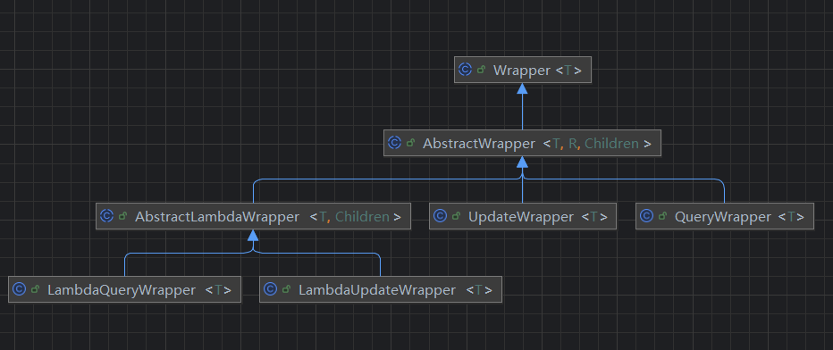

# 简介

> [MyBatis-Plus](https://github.com/baomidou/mybatis-plus) 是一个 [MyBatis](https://www.mybatis.org/mybatis-3/) 的增强工具，在 MyBatis 的基础上只做增强不做改变，为简化开发、提高效率而生。

上述是 [MybatisPlus 官网首页](https://baomidou.com/introduce/) 对 MybatisPlus(以后简称MP) 的 介绍，要点是 **只做增强不做改变**，即原来Mybatis的用法将在MP上得到延续，并在此基础上提供更多便利的特性。

本笔记总结参考自[尚硅谷视频](https://www.bilibili.com/video/BV1AP411s7D7?p=152) 和 对应的[文档](https://www.wolai.com/wUtasRKRucM7geUQqHSXdU)，我的仓库地址为[My-MyBatisPlus-Framework](https://github.com/LordBao666/My-MyBatisPlus-Framework)。

参照尚硅谷提供的文档标题，将笔记整理为

- MP核心功能
- MP高级拓展
- Mybaits代码生成器


# 笔记总结

## MP核心功能

**MP对 Dao层 ， 甚至是Service层进行了增强**，使得程序员免于写基础的重复的代码。详细内容可以参考[官方文档](https://baomidou.com/guides/data-interface)，这里只是做简要介绍。

假设类`User`对应于数据库的一张表`user`

```java
@Data
@AllArgsConstructor
@NoArgsConstructor
public class User {
    private Long id;
    private String name;
    private Integer age;
    private String email;
}
```


### Dao层增强

**Dao层的增强如下**：

```java
public interface UserMapper extends BaseMapper<User> {
}
```

<span style="color:#9B5DE5">在Dao层 仅仅 将`xxxMapper`接口继承自`BaseMapper<xxx>`，就可以使得`xxxMapper`拥有诸多基本的增删改查的方法</span>。BaseMapper的方法如下所示，详细内容见[官方文档](https://baomidou.com/guides/data-interface)

```java
int insert(T entity);
int deleteById(Serializable id);
int deleteById(Object obj, boolean useFill);
int deleteById(T entity);
int deleteByMap(Map<String, Object> columnMap);
int delete(@Param("ew") Wrapper<T> queryWrapper);
int deleteBatchIds(@Param("coll") Collection<?> idList);
int deleteByIds(@Param("coll") Collection<?> idList);
int deleteByIds(@Param("coll") Collection<?> collections, boolean useFill);
int updateById(@Param("et") T entity);
int update(@Param("et") T entity, @Param("ew") Wrapper<T> updateWrapper);
int update(@Param("ew") Wrapper<T> updateWrapper);
T selectById(Serializable id);
List<T> selectBatchIds(@Param("coll") Collection<? extends Serializable> idList);
void selectBatchIds(@Param("coll") Collection<? extends Serializable> idList, ResultHandler<T> resultHandler);
List<T> selectByMap(Map<String, Object> columnMap);
void selectByMap(Map<String, Object> columnMap, ResultHandler<T> resultHandler);
T selectOne(@Param("ew") Wrapper<T> queryWrapper);
T selectOne(@Param("ew") Wrapper<T> queryWrapper, boolean throwEx);
boolean exists(Wrapper<T> queryWrapper);
Long selectCount(@Param("ew") Wrapper<T> queryWrapper);
List<T> selectList(@Param("ew") Wrapper<T> queryWrapper);
void selectList(@Param("ew") Wrapper<T> queryWrapper, ResultHandler<T> resultHandler);
List<T> selectList(IPage<T> page, @Param("ew") Wrapper<T> queryWrapper);
void selectList(IPage<T> page, @Param("ew") Wrapper<T> queryWrapper, ResultHandler<T> resultHandler);
List<Map<String, Object>> selectMaps(@Param("ew") Wrapper<T> queryWrapper);
void selectMaps(@Param("ew") Wrapper<T> queryWrapper, ResultHandler<Map<String, Object>> resultHandler);
List<Map<String, Object>> selectMaps(IPage<? extends Map<String, Object>> page, @Param("ew") Wrapper<T> queryWrapper);
void selectMaps(IPage<? extends Map<String, Object>> page, @Param("ew") Wrapper<T> queryWrapper, ResultHandler<Map<String, Object>> resultHandler);
<E> List<E> selectObjs(@Param("ew") Wrapper<T> queryWrapper);
<E> void selectObjs(@Param("ew") Wrapper<T> queryWrapper, ResultHandler<E> resultHandler);
<P extends IPage<T>> P selectPage(P page, @Param("ew") Wrapper<T> queryWrapper);
<P extends IPage<Map<String, Object>>> P selectMapsPage(P page, @Param("ew") Wrapper<T> queryWrapper);
boolean insertOrUpdate(T entity);
List<BatchResult> insert(Collection<T> entityList);
List<BatchResult> insert(Collection<T> entityList, int batchSize);
List<BatchResult> updateById(Collection<T> entityList);
List<BatchResult> updateById(Collection<T> entityList, int batchSize);
List<BatchResult> insertOrUpdate(Collection<T> entityList);
List<BatchResult> insertOrUpdate(Collection<T> entityList, int batchSize);
List<BatchResult> insertOrUpdate(Collection<T> entityList, BiPredicate<BatchSqlSession, T> insertPredicate);
List<BatchResult> insertOrUpdate(Collection<T> entityList, BiPredicate<BatchSqlSession, T> insertPredicate, int batchSize);

```

在这个情况下，我们可以省去很多重复代码，在xxxMapper.xml 只需写复杂的增删改查操作即可。另外上面涉及到了`Wrapper`接口，该接口被称作为条件构造器，后面将会阐述，此处暂且不表。


### Service层增强

**MP甚至对Service层做了增强**：

第1步：接口继承IService接口

```Java
public interface UserService extends IService<User> {
}

```

 第2步：类继承ServiceImpl实现类，并实现UserService接口

```Java
@Service
public class UserServiceImpl extends ServiceImpl<UserMapper,User> implements UserService{
}
```

如果用户有额外的自定义方法，则像往常一样，在接口定义方法，在实现类进行实现即可。

<span style="color:#9B5DE5">在具体使用的时候，甚至忽略Dao层，仅需在控制层注入`UserService`</span>：

```java
public class UserController{
	@Autowired
	private UserService userService;
}
```

相对于Dao层的增强以外，Service层的增强有所不同：

1. service层添加了批量方法，即叫做`xxxBatch`的方法以进行批量操作
  2. service层的方法自动添加事务

Service层的具体增强详见[官方文档](https://baomidou.com/guides/data-interface)，IService接口的方法如下

```java
boolean save(T entity);
boolean saveBatch(Collection<T> entityList);
boolean saveBatch(Collection<T> entityList, int batchSize);
boolean saveOrUpdateBatch(Collection<T> entityList);
boolean saveOrUpdateBatch(Collection<T> entityList, int batchSize);
boolean removeById(Serializable id);
boolean removeById(Serializable id, boolean useFill);
boolean removeById(T entity);
boolean removeByMap(Map<String, Object> columnMap);
boolean remove(Wrapper<T> queryWrapper);
boolean removeByIds(Collection<?> list);
boolean removeByIds(Collection<?> list, boolean useFill);
boolean removeBatchByIds(Collection<?> list);
boolean removeBatchByIds(Collection<?> list, boolean useFill);
boolean removeBatchByIds(Collection<?> list, int batchSize);
boolean removeBatchByIds(Collection<?> list, int batchSize, boolean useFill);
boolean updateById(T entity);
boolean update(Wrapper<T> updateWrapper);
boolean update(T entity, Wrapper<T> updateWrapper);
boolean updateBatchById(Collection<T> entityList);
boolean updateBatchById(Collection<T> entityList, int batchSize);
boolean saveOrUpdate(T entity);
T getById(Serializable id);
Optional<T> getOptById(Serializable id);
List<T> listByIds(Collection<? extends Serializable> idList);
List<T> listByMap(Map<String, Object> columnMap);
T getOne(Wrapper<T> queryWrapper);
T getOne(Wrapper<T> queryWrapper, boolean throwEx);
Optional<T> getOneOpt(Wrapper<T> queryWrapper);
Optional<T> getOneOpt(Wrapper<T> queryWrapper, boolean throwEx);
Map<String, Object> getMap(Wrapper<T> queryWrapper);
<V> V getObj(Wrapper<T> queryWrapper, Function<? super Object, V> mapper);
boolean exists(Wrapper<T> queryWrapper);
long count();
long count(Wrapper<T> queryWrapper);
List<T> list(Wrapper<T> queryWrapper);
List<T> list(IPage<T> page, Wrapper<T> queryWrapper);
List<T> list();
List<T> list(IPage<T> page);
<E extends IPage<T>> E page(E page, Wrapper<T> queryWrapper);
<E extends IPage<T>> E page(E page);
List<Map<String, Object>> listMaps(Wrapper<T> queryWrapper);
List<Map<String, Object>> listMaps(IPage<? extends Map<String, Object>> page, Wrapper<T> queryWrapper);
List<Map<String, Object>> listMaps();
List<Map<String, Object>> listMaps(IPage<? extends Map<String, Object>> page);
<E> List<E> listObjs();
<V> List<V> listObjs(Function<? super Object, V> mapper);
<E> List<E> listObjs(Wrapper<T> queryWrapper);
<V> List<V> listObjs(Wrapper<T> queryWrapper, Function<? super Object, V> mapper);
<E extends IPage<Map<String, Object>>> E pageMaps(E page, Wrapper<T> queryWrapper);
<E extends IPage<Map<String, Object>>> E pageMaps(E page);
BaseMapper<T> getBaseMapper();
Class<T> getEntityClass();
QueryChainWrapper<T> query();
LambdaQueryChainWrapper<T> lambdaQuery();
LambdaQueryChainWrapper<T> lambdaQuery(T entity);
KtQueryChainWrapper<T> ktQuery();
KtUpdateChainWrapper<T> ktUpdate();
UpdateChainWrapper<T> update();
LambdaUpdateChainWrapper<T> lambdaUpdate();
boolean saveOrUpdate(T entity, Wrapper<T> updateWrapper);
```


### 条件构造器

如下是官网对MP的条件构造器的阐述

> 在 MyBatis-Plus 中，Wrapper 类是构建查询和更新条件的核心工具。以下是主要的 Wrapper 类及其功能：
>
> - **AbstractWrapper**：这是一个抽象基类，提供了所有 Wrapper 类共有的方法和属性。它定义了条件构造的基本逻辑，包括字段（column）、值（value）、操作符（condition）等。所有的 **QueryWrapper、UpdateWrapper、LambdaQueryWrapper 和 LambdaUpdateWrapper 都继承自 AbstractWrapper**。
> - **QueryWrapper**：**专门用于构造查询条件**，支持基本的等于、不等于、大于、小于等各种常见操作。它允许你以**链式调用**的方式添加多个查询条件，并且可以组合使用 `and` 和 `or` 逻辑。
> - **UpdateWrapper**：用于构造更新条件，可以在更新数据时指定条件。与 QueryWrapper 类似，它也支持**链式调用和逻辑组合**。使用 UpdateWrapper 可以在不创建实体对象的情况下，**直接设置更新字段和条件**。
> - **LambdaQueryWrapper**：这是一个基于 Lambda 表达式的查询条件构造器，它通过 Lambda 表达式来引用实体类的属性，从而避免了**硬编码字段名**。这种方式提高了代码的可读性和可维护性，尤其是在字段名可能发生变化的情况下。
> - **LambdaUpdateWrapper**：类似于 LambdaQueryWrapper，LambdaUpdateWrapper 是基于 Lambda 表达式的更新条件构造器。它允许你使用 Lambda 表达式来指定更新字段和条件，同样避免了硬编码字段名的问题。

继承体系如下：



这里需要做如下几点解释：

**注释1**：`xxxWrapper`都支持链式调用，即支持类似于`wrapper.eq("name","jack).eq("age",18)`的这种语法。

**注释2**：条件构造器主要用于设置条件，对应于`where`子句，但实际上它也可以用在`select`和`set`子句，这里后面会做例子。

**注释3**：`QueryWrapper,UpdateWrappper` 和 `LambdaQueryWrapper,LambdaUpdateWrappper`的差别在于**后者避免了硬编码的问题**，举例如下：

**QueryWrapper**

```java
//select * from user where age = #{age}
QueryWrapper<User> wrapper = new QueryWrapper<>();
wrapper.eq("age",18);
List<User> users = userMapper.selectList(wrapper);
```

**LambdaQueryWrapper**

```java
//select * from user where age = #{age}
LambdaQueryWrapper<User> wrapper =  new LambdaQueryWrapper<>();
wrapper.eq(User::getAge,18);
List<User> users = userMapper.selectList(wrapper);
```

为什么`LambdaQueryWrapper`好？**因为在编译阶段，如果你打错字，比如将`age`打成了`aeg`，`QueryWrapper`并不会报错，而`LambdaQueryWrapper`是会报错的**。

因此以后我们通常采用`LambdaQueryWrapper,LambdaUpdateWrappper`。


**注释4**：`LambdaQueryWrapper,LambdaUpdateWrappper`有什么差别（`QueryWrapper,UpdateWrappper`的差别是类似的）？

对于增删改查而言，增是不需要条件构造器的，仅删改查需要。**一个常用的规则是，`LambdaQueryWrapper`用于删和查的条件构造，`LambdaUpdateWrappper`用于改的条件构造**。

首先需要知道的是，`LambdaQueryWrapper`并非不可用于改的条件改造，只是有所限制，举例如下：

```java
        //update user set email=#{email} where name =#{name}
        User user = new User();
        user.setEmail("JohnnyJoestar@gmail.com");
        LambdaQueryWrapper<User> wrapper =  new LambdaQueryWrapper<>();
        wrapper.eq(User::getName,"JohnnyJoestar");
        userMapper.update(user,wrapper);
```

关于改，这里有一个默认规则，**即对于实体类中的引用类型，仅针对非null属性的进行`set`，比如上面的email，而对于基本类型，通通参与改的操作**，因此这里的建议是建议将基本类型都改为对应的包装类型，并采用`LambdaUpdateWrapper`来进行修改。

第一种改法

```java
        //update user set email=#{email}  where name =#{name}
        User user = new User();
        user.setEmail("JohnnyJoestar@gmail.com");
        LambdaUpdateWrapper<User> wrapper = new LambdaUpdateWrapper<>();
        wrapper.eq(User::getName,"JohnnyJoestar");
        userMapper.update(user,wrapper);
```

这种改法并没有什么实质变化。

第二种改法

```java
        //update user set email=#{email}  where name =#{name}
        LambdaUpdateWrapper<User> wrapper = new LambdaUpdateWrapper<>();
        wrapper.set(User::getEmail,"JohnnyJoestar@gmail.com");
        wrapper.eq(User::getName,"JohnnyJoestar");
//        userMapper.update(null,wrapper); //null表示空实体，此时效果和下面的userMapper.update(wrapper)的相同
        userMapper.update(wrapper);
```

第二种改法的变化就大了，通过将原先通过实体来设置`set`，变为了通过`wrapper`来设置`set`。**这种的好处在于，它甚至可以set null，比如`wrapper.set(User::getEmail,null)`**。


**注释5**：条件构造器可以用于`select`。

```java
       //SELECT name,age FROM user
		QueryWrapper<User> userQueryWrapper = new QueryWrapper<>();
        userQueryWrapper.select("name","age");

        List<Map<String, Object>> maps = userMapper.selectMaps(userQueryWrapper);
        for(Map<String, Object> map:maps){
            System.out.println(map);
        }
```

输出：

> {name=jojo1, age=17}
> {name=jojo2, age=18}
> {name=jojo3, age=19}


**注释6**：条件构造器可用于condition判断，效果等价于动态sql拼接。

一个简单的需求是，当用户的年龄满18时，追加查询条件，用户的名字含a。

```java
        LambdaQueryWrapper<User> wrapper = new LambdaQueryWrapper<>();
        Integer age = 17;
        wrapper.like(age>18,User::getName,"a");
        userMapper.selectList(wrapper).forEach(System.out::println);
```

当age为17时，上面等价的sql语句为`select * from user`；当age为19时，上面等价的sql语句为`select * from user where name like 'a'`。


### MP 核心注解

MP有三大核心注解，即`@TableName,@TableId,@TableField`。详细的使用，见[官方文档](https://baomidou.com/reference/annotation/#tablename)。

**`@TableName`**

MP本身自动是开启了驼峰式映射，但是仍然可能存在表和Java实体之间不对应的情况，在这种情况下，可以通过`@TableName`完成Java实体到表的映射。

举例说明：假设Java实体类是User，而对应的表为`t_user`，那么就需要做如下映射

```java
@TableName("t_user")
public User{
//
}
```

若这种情况并非偶然，即存在所有的表都有`t_xxx`和对应的实体为xxx的情况，建议直接采用配置，而非`@TableName`

```yaml
mybatis-plus: # mybatis-plus的配置
  global-config:
    db-config:
      table-prefix: t_ # 表名前缀字符串
```


**`@TableId`**

`@TableId`用于标识主键，**这是必需的**，MP诸如`selectById`方法要求通过`@TableId`来标识主键。`@TableId`还用于Java实体主键属性 和 表主键不一致时的映射，以及声明主键策略。

```java
@TableName("t_user")
public class User {
    @TableId(value="主键列名",type=主键策略)
    private Long id;
    private String name;
    private Integer age;
    private String email;
}
```

关于主键策略，参考[官方文档](https://baomidou.com/reference/annotation/#type)。

> **类型：** `Enum`
> **默认值：** `IdType.NONE`
>
> 指定主键的生成策略。
>
> **IdType 枚举类型定义**
>
> - `IdType.AUTO`：使用数据库自增 ID 作为主键。
> - `IdType.NONE`：无特定生成策略，如果全局配置中有 IdType 相关的配置，则会跟随全局配置。
> - `IdType.INPUT`：在插入数据前，由用户自行设置主键值。
> - `IdType.ASSIGN_ID`：自动分配 `ID`，适用于 `Long`、`Integer`、`String` 类型的主键。默认使用雪花算法通过 `IdentifierGenerator` 的 `nextId` 实现。@since 3.3.0
> - `IdType.ASSIGN_UUID`：自动分配 `UUID`，适用于 `String` 类型的主键。默认实现为 `IdentifierGenerator` 的 `nextUUID` 方法。@since 3.3.0

你可以将主键策略在全局中进行配置

```yml
mybatis-plus:
  global-config:
    db-config:
      id-type: auto #配置主键策略为自增长
```


**`@TableField`**

`@TableField`并不是必需的，它主要用于Java实体的非主键属性和数据库表的非主键列名的映射。

```java
@TableName("t_user")
public class User {
    @TableId(value="主键列名",type=主键策略)
    private Long id;
    @TableField("nickname")
    private String name;
    private Integer age;
    private String email;
}
```


## MP高级拓展

### 分页实现

在尚硅谷的讲述中，并没有将分页实现放入到高级拓展这里。但由于在讲述Mybatis的时候，曾将分页查询放到了高级拓展，因此为了便于对应，也将分页查询当做MP的高级拓展放到此处。

**第1步**：加入分页查询插件

```java
@SpringBootApplication
@MapperScan("com.lordbao.mapper")
public class MainApplication {
    public static void main(String[] args) {
        SpringApplication.run(MainApplication.class,args);
    }

    @Bean
    public MybatisPlusInterceptor mybatisPlusInterceptor(){
        MybatisPlusInterceptor mybatisPlusInterceptor = new MybatisPlusInterceptor();
        //加入分页查询插件
        mybatisPlusInterceptor.addInnerInterceptor(new PaginationInnerInterceptor());
        return mybatisPlusInterceptor;
    }
}
```

**第2步**：根据具体情况，来撰写相应的代码。

**1 如果是单表查询，采用MP提供的相关方法即可，比如`BaseMapper`的如下方法等**

```java
<P extends IPage<T>> P selectPage(P page, @Param("ew") Wrapper<T> queryWrapper)
List<T> selectList(IPage<T> page, @Param("ew") Wrapper<T> queryWrapper);
IPage<Map<String, Object>> selectMapsPage(IPage<T> page, @Param(Constants.WRAPPER) Wrapper<T> queryWrapper);
```

当然`IService`也有相应的方法，查询相关文档即可。

以`selectPage`为例，

```java
   @Test
    public void testPage(){
        //the first parameter is the current page you want to loop up,
        //the second parameter is the size of each page
        Page<User> p = new Page<>(1,2);
        userMapper.selectPage(p, null);
        List<User> userList = p.getRecords();
        System.out.println(userList);
        //long: current page,the first parameter of Page's constructor above
        System.out.println(p.getCurrent());
        //long: the size of each page, the second parameter  of Page's constructor above
        System.out.println(p.getSize());
        System.out.println(p.getPages());//long: the total number of pages
        System.out.println(p.getTotal());//long: the total number of records
        System.out.println(p.hasPrevious());//a boolean shows if p has previous page
        System.out.println(p.hasNext());//a boolean shows if p has next page
    }
```

基本步骤：

1. 创建一个Page对象，第一个参数为你查询的第几页(从1开始)，第二个参数为每页的大小；
2. 将Page对象传入到`userMapper.selectPage(p, null)`中，第二个参数为条件构造器`Wrapper`；
3. 通过`p.getRecords()`拿到查询的集合。


2 **如果是多表查询，或者说只想拿到单表的某几个属性，前者需要自己撰写方法，后者也可以自己撰写方法实现**。

假定存在两张表

`t_order`

```java
create table t_order
(
    order_id    int auto_increment
        primary key,
    order_name  char(100) null,
    customer_id int       null
);
```

`t_customer`

```java
create table t_customer
(
    customer_id   int auto_increment
        primary key,
    customer_name char(100) null
);
```

我现在的需求为**根据customer_id  得到用户的所有订单，但是要求订单上必须含有customer_name的属性，并在此基础上进行分页**。

显然，这个案例涉及到了多表查询，原有的BaseMapper无法直接分页。先不考虑分页的情况，代码撰写如下

**OrderVo**

```java
@Data
public class OrderVo {
    private Integer orderId;
    private String orderName;
    private Integer customerId;
    private String customerName;
}
```

**OrderMapper**

```java
public interface OrderMapper extends BaseMapper<Order> {
    public List<OrderVo> queryOrderVoByCustomerId(Integer customerId);
}
```

**OrderMapper.xml**

```xml
<?xml version="1.0" encoding="UTF-8"?>
<!DOCTYPE mapper
        PUBLIC "-//mybatis.org//DTD Mapper 3.0//EN"
        "http://mybatis.org/dtd/mybatis-3-mapper.dtd">
<mapper namespace="com.lordbao.mapper.OrderMapper">

    <sql id="queryOrderVoByCustomerId">
        select order_id, order_name, o.customer_id,  customer_name
        from  t_order o
                  left join t_customer c
                            on o.customer_id = c.customer_id
        where c.customer_id = #{customerId}
    </sql>
    <select id="queryOrderVoByCustomerId" resultType="com.lordbao.pojo.vo.OrderVo">
        <include refid="queryOrderVoByCustomerId"/>
    </select>
</mapper>

```

**测试代码**

```java
@Test
public void testOrderVo(){
    List<OrderVo> orderVoList = orderMapper.queryOrderVoByCustomerId(1);
    orderVoList.forEach(System.out::println);
}
```

结果如下

> OrderVo(orderId=1, orderName=o1, customerId=1, customerName=c01)
> OrderVo(orderId=2, orderName=o2, customerId=1, customerName=c01)
> OrderVo(orderId=3, orderName=o3, customerId=1, customerName=c01)
> OrderVo(orderId=4, orderName=o4, customerId=1, customerName=c01)
> OrderVo(orderId=5, orderName=o5, customerId=1, customerName=c01)
> OrderVo(orderId=6, orderName=o6, customerId=1, customerName=c01)


现在我们基于此，进行分页，首先仍然是导入分页插件(此步略)，并撰写代码如下：

**OrderMapper**

```java
public interface OrderMapper extends BaseMapper<Order> {
    public IPage<OrderVo> queryOrderVoPageByCustomerId(IPage<OrderVo> page,Integer customerId);
}
```

**OrderMapper.xml**

```xml
<?xml version="1.0" encoding="UTF-8"?>
<!DOCTYPE mapper
        PUBLIC "-//mybatis.org//DTD Mapper 3.0//EN"
        "http://mybatis.org/dtd/mybatis-3-mapper.dtd">
<mapper namespace="com.lordbao.mapper.OrderMapper">

    <sql id="queryOrderVoByCustomerId">
        select order_id, order_name, o.customer_id,  customer_name
        from  t_order o
                  left join t_customer c
                            on o.customer_id = c.customer_id
        where c.customer_id = #{customerId}
    </sql>

    <select id="queryOrderVoPageByCustomerId" resultType="com.lordbao.pojo.vo.OrderVo">
        <include refid="queryOrderVoByCustomerId"/>
    </select>

</mapper>

```

**测试代码**

```java
    @Test
    public void testOrderVoPage(){
        int currentPage=2;
        int size =2;
        Page<OrderVo> page = new Page<>(currentPage,size);
        Integer customerId =1;
        orderMapper.queryOrderVoPageByCustomerId(page,customerId);

        List<OrderVo> orderVoList = page.getRecords();
        orderVoList.forEach(System.out::println);
    }
```

结果如下

> OrderVo(orderId=3, orderName=o3, customerId=1, customerName=c01)
> OrderVo(orderId=4, orderName=o4, customerId=1, customerName=c01)


<span style="color:#9B5DE5">需要注意的是，MP的分页并不适用于涉及嵌套查询(Mybaits中的`association,collection`标签)，其得到的结果是不准确的</span>。


### 逻辑删除

逻辑删除针对的场景：如何将删除的数据恢复呢？事实上，我们可以一开始就对数据进行逻辑删除，而非物理删除。

逻辑删除需要在表中添加新的字段，并涉及到`@TableLogic`注解或全局逻辑字段配置。详细的内容见笔记。


### 悲观锁和乐观锁

考虑如下场景，假设某件商品库存有1000件，一个用户下单(假设下单一件)的同时，另外的用户也进行下单(假设下单一件)，那么在完成这个操作之后，库存是998件，还是999件呢？我们要做的就是预防后面这种非法情况的发生——悲观锁和乐观锁是解决此类数据并发访问相关问题的机制。

悲观锁的基本思想是，访问某个共享资源时，将整个资源锁住，待访问完毕，才允许其他人访问。悲观锁的问题在于这样的代价很大。

乐观锁的基本思想是，访问某个共享资源前，会得到该共享资源的版本号，在进行对共享资源的更新时，会检验版本号，如果得到的版本不一致，则会进行相应的冲突处理。

乐观锁的实现需要添加相关的组件`OptimisticLockerInnerInterceptor`，在表中添加新的字段，并涉及到`@Version`注解。详细的内容见笔记。


### 防全局更新和全局删除

防全局更新和全局删除是一种安全机制，详细的内容见笔记。


## Mybaits代码生成器

Mybaits代码生成器 将 根据表生成MP相关的Pojo，Mapper，Mapper.xml，Service等静态代码。需要注意的是，这仅适合在早期生成代码的时候有用，**<span style="color:#9B5DE5">如果你修改了数据库表，然后再想生成静态代码，则必然会对原有的代码造成覆盖</span>**。


# 模块对应学习顺序

- mybatisplus-quickstart
- mybatisplus-core
- mybatisplus-code-generator

